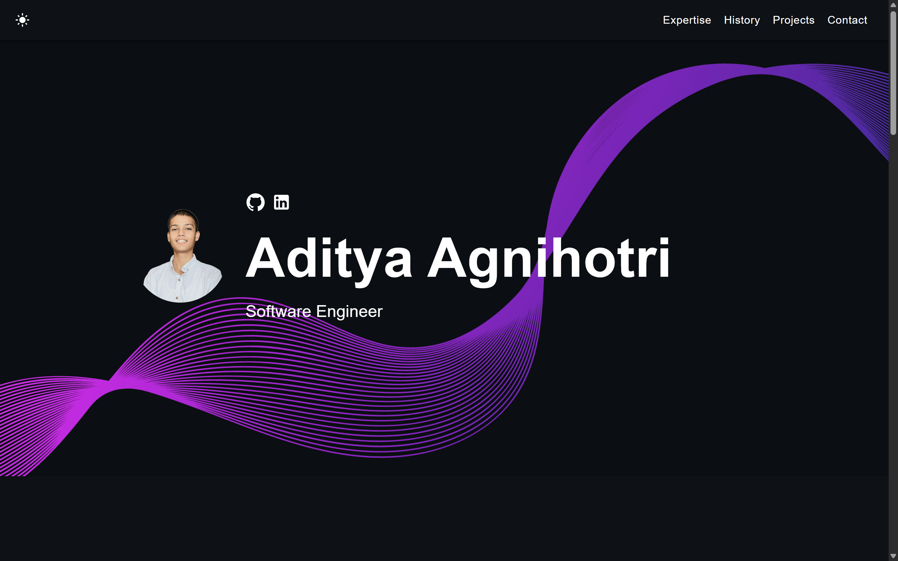

# Aditya Agnihotri – Developer Portfolio 🚀

[]
[]
[]
[]
[]
[]
[]

## 🌐 Live Portfolio

Check out my portfolio here: [MyPortfolio](https://agniaditya.github.io/MyPortfolio/)

---

## 📖 About

Welcome to my personal developer portfolio!  
This website is a showcase of my work, experience, and technical skills as a Software Engineer. Here, you’ll find:

- **About Me**  
  Learn who I am, my background, and my professional focus.

- **Skills & Expertise**  
  A dynamic list of my primary technical skills—front-end, back-end, and tools.

- **Projects**  
  Detailed highlights of select projects, including:
  - **House Price Prediction**  
    End-to-end MLOps system using ZenML, MLflow, Docker, with CI/CD pipelines, cloud integration, and real-time database support.
    [Project Source](https://github.com/AgniAditya/EndToEnd-MLOps-HousePricePrediction)

- **Timeline/Experience**  
  My education and career milestones.

- **Contact**  
  Direct links to connect with me via GitHub or LinkedIn.

---

## ✨ Features

- Responsive design & mobile-friendly
- Dark and light mode support
- Modern, component-based architecture (React, TypeScript, SCSS)
- Easily updatable and extensible for new projects or skills

---

## 🛠️ Getting Started

To run this portfolio locally:

1. **Clone the repo**
    ```bash
    git clone https://github.com/AgniAditya/MyPortfolio.git
    cd MyPortfolio
    ```

2. **Install dependencies**
    ```bash
    npm install
    ```

3. **Start the development server**
    ```bash
    npm start
    ```
    The app should now be running at [http://localhost:3000](http://localhost:3000).

---

## 🚀 Deployment

This portfolio is deployed via **GitHub Pages**:  
[https://agniaditya.github.io/MyPortfolio/](https://agniaditya.github.io/MyPortfolio/)

To deploy your own changes:

1. Update `"homepage"` in `package.json` to your GitHub Pages URL.
2. Run:
    ```bash
    npm run deploy
    ```

---

## 📸 Screenshot



---

## 🤝 Connect with Me

- [GitHub](https://github.com/AgniAditya)
- [LinkedIn](https://www.linkedin.com/in/aditya-agnihotri-097408302/)

---

> _Thank you for visiting my portfolio!_
